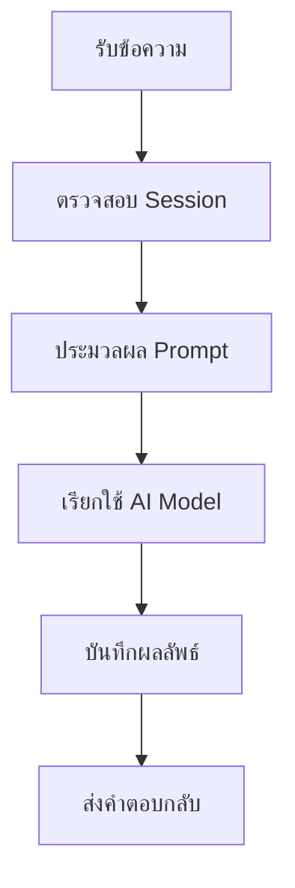
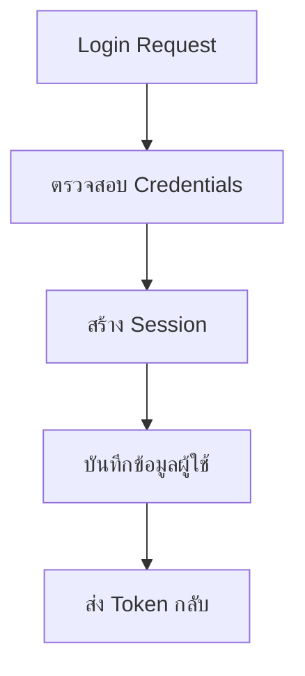

# เอกสารอธิบายโค้ด Backend สำหรับผู้ใช้ทั่วไป

## 📁 โครงสร้างไฟล์

```
backend/
├── main.py              # ไฟล์หลักสำหรับ FastAPI application
├── config.py            # การตั้งค่าระบบ
├── language_models.py   # การจัดการโมเดลภาษา AI
├── mongodb_manager.py   # การจัดการฐานข้อมูล MongoDB
├── session_manager.py   # การจัดการ session
├── user_analyzer.py     # การวิเคราะห์ข้อมูลผู้ใช้
├── vector_store.py      # การจัดการ vector store
└── run.py              # ไฟล์สำหรับรัน server
```

## 🔧 การทำงานของแต่ละไฟล์

### 1. main.py
ไฟล์หลักที่รวม endpoint ทั้งหมดและจัดการ request/response

#### หน้าที่หลัก:
- สร้าง FastAPI application
- ตั้งค่า middleware
- กำหนด routes ทั้งหมด
- จัดการ request การแชท
- จัดการการยืนยันตัวตน
- จัดการการตั้งค่า

#### ตัวอย่างโค้ด:
```python
@app.post("/api/chat")
async def handle_chat(request: ChatRequest):
    try:
        # ตรวจสอบ session
        session = await validate_session(request.session_id)
        
        # ประมวลผล prompt
        processed_prompt = await process_prompt(request.message)
        
        # เรียกใช้ AI model
        response = await generate_response(processed_prompt)
        
        # บันทึกผลลัพธ์
        await save_chat(session.user_id, request.message, response)
        
        return {"response": response}
    except Exception as e:
        raise HTTPException(status_code=500, detail=str(e))
```

### 2. config.py
จัดการการตั้งค่าระบบทั้งหมด

#### หน้าที่หลัก:
- โหลดการตั้งค่าจากไฟล์
- ดึงการตั้งค่าฐานข้อมูล
- ดึงการตั้งค่า AI
- ดึงการตั้งค่าความปลอดภัย

#### ตัวอย่างโค้ด:
```python
MODEL_CONFIG = {
    'embedding_model': 'text-embedding-ada-002',
    'chat_model': 'gpt-3.5-turbo',
    'max_tokens': 1000
}

CONSULTATION_STYLES = {
    'formal': 'ทางการ',
    'casual': 'เป็นกันเอง',
    'friendly': 'เป็นมิตร',
    'professional': 'มืออาชีพ'
}
```

### 3. language_models.py
จัดการการทำงานกับโมเดลภาษา AI

#### หน้าที่หลัก:
- เริ่มต้นโมเดล AI
- สร้างคำตอบจาก AI
- ประมวลผล prompt
- จัดการการส่งข้อมูลแบบ streaming

#### ตัวอย่างโค้ด:
```python
class LanguageModelManager:
    def generate_response(self, query: str, properties: List[Dict[str, Any]], style: str = "formal"):
        try:
            # ตรวจสอบว่าพบข้อมูลหรือไม่
            if not properties:
                responses = {
                    "formal": f"ขออภัยครับ ทางเราไม่พบข้อมูลอสังหาริมทรัพย์ที่ตรงกับคำถาม '{query}'",
                    "casual": f"เราไม่เจอข้อมูลที่คุณถามเกี่ยวกับ '{query}' ลองถามใหม่ด้วยคำอื่นได้นะ",
                    "friendly": f"โอ้! ดูเหมือนว่าเรายังไม่มีข้อมูลเกี่ยวกับ '{query}' เลย",
                    "professional": f"ผมขอแจ้งว่าไม่พบข้อมูลอสังหาริมทรัพย์ที่ตรงตามเงื่อนไข '{query}'"
                }
                return responses.get(style, responses["formal"])
            
            # สร้างคำอธิบายอสังหาริมทรัพย์
            property_descriptions = []
            for i, prop in enumerate(properties):
                desc = f"{i+1}. "
                
                if "ประเภท" in prop:
                    desc += f"{prop['ประเภท']} "
                
                if "โครงการ" in prop:
                    desc += f"{prop['โครงการ']} "
                
                if "ราคา" in prop:
                    desc += f"ราคา {prop['ราคา']} บาท "
                
                if "รูปแบบ" in prop:
                    desc += f"({prop['รูปแบบ']}) "
                
                nearby = []
                if "สถานศึกษา" in prop and prop["สถานศึกษา"] != "ไม่มี":
                    nearby.append(f"ใกล้{prop['สถานศึกษา']}")
                
                if "สถานีรถไฟฟ้า" in prop and prop["สถานีรถไฟฟ้า"] != "ไม่มี":
                    nearby.append(f"ใกล้{prop['สถานีรถไฟฟ้า']}")
                    
                if "ห้างสรรพสินค้า" in prop and prop["ห้างสรรพสินค้า"] != "ไม่มี":
                    nearby.append(f"ใกล้{prop['ห้างสรรพสินค้า']}")
                    
                if nearby:
                    desc += f" {', '.join(nearby)}"
                    
                property_descriptions.append(desc)
            
            property_text = "\n".join(property_descriptions)
            
            # สร้างคำตอบตามสไตล์
            intros = {
                "formal": f"สำหรับคำถามเกี่ยวกับ '{query}' ทางเรามีข้อมูลอสังหาริมทรัพย์ที่น่าสนใจดังนี้:\n\n",
                "casual": f"เกี่ยวกับ '{query}' ที่คุณถามมา เรามีตัวเลือกเหล่านี้นะ:\n\n",
                "friendly": f"สำหรับ '{query}' ที่คุณสนใจ มีตัวเลือกน่าสนใจเหล่านี้เลยค่ะ:\n\n",
                "professional": f"ตามที่คุณสอบถามเกี่ยวกับ '{query}' ผมได้คัดสรรอสังหาริมทรัพย์ที่ตรงกับความต้องการของคุณดังนี้:\n\n"
            }
            
            outros = {
                "formal": "\n\nท่านสนใจทรัพย์สินรายการใดเป็นพิเศษหรือไม่ ทางเรายินดีให้ข้อมูลเพิ่มเติมครับ",
                "casual": "\n\nสนใจตัวไหนเป็นพิเศษมั้ย จะได้บอกรายละเอียดเพิ่มเติมให้",
                "friendly": "\n\nชอบตัวไหนเป็นพิเศษบ้างคะ บอกได้เลยนะ เดี๋ยวเราช่วยดูข้อมูลเพิ่มให้ค่ะ",
                "professional": "\n\nหากคุณสนใจอสังหาริมทรัพย์รายการใดเป็นพิเศษ ผมสามารถให้ข้อมูลเชิงลึกและจัดการดูพื้นที่จริงให้ได้ครับ"
            }
            
            intro = intros.get(style, intros["formal"])
            outro = outros.get(style, outros["formal"])
            
            return intro + property_text + outro
            
        except Exception as e:
            logger.error(f"Error generating response: {str(e)}")
            return "ขออภัย เกิดข้อผิดพลาดในการประมวลผลคำตอบ กรุณาลองใหม่อีกครั้ง"
```

### 4. mongodb_manager.py
จัดการการเชื่อมต่อและทำงานกับ MongoDB

#### หน้าที่หลัก:
- เชื่อมต่อกับฐานข้อมูล
- บันทึกประวัติการแชท
- ดึงประวัติการแชทของผู้ใช้
- อัพเดทการตั้งค่าผู้ใช้

#### ตัวอย่างโค้ด:
```python
class MongoDBManager:
    def save_chat(self, user_id: str, message: str, response: str):
        try:
            chat_data = {
                "user_id": user_id,
                "message": message,
                "response": response,
                "timestamp": datetime.now()
            }
            
            await db.chats.insert_one(chat_data)
            
            return chat_data
        except Exception as e:
            raise DatabaseError(f"Failed to save chat: {str(e)}")

    def get_user_history(self, user_id: str, limit: int = 50):
        try:
            history = await db.chats.find(
                {"user_id": user_id}
            ).sort(
                "timestamp", -1
            ).limit(limit).to_list(length=limit)
            
            return history
        except Exception as e:
            raise DatabaseError(f"Failed to get user history: {str(e)}")
```

### 5. session_manager.py
จัดการ session และการยืนยันตัวตน

#### หน้าที่หลัก:
- สร้าง session ใหม่
- ตรวจสอบความถูกต้องของ session
- รีเฟรช token
- ยกเลิก session

#### ตัวอย่างโค้ด:
```python
class SessionManager:
    def create_session(self, user_id: Optional[str] = None) -> str:
        try:
            session_id = f"session_{secrets.token_hex(8)}"
            timestamp = datetime.now()
            
            session_data = {
                "session_id": session_id,
                "user_id": user_id,
                "created_at": timestamp,
                "last_activity": timestamp,
                "messages": []
            }
            
            # เก็บในหน่วยความจำ
            self.sessions[session_id] = session_data
            
            # เก็บใน MongoDB ถ้ามี
            if self.mongodb_manager:
                self.mongodb_manager.create_session(session_id, user_id)
                
            logger.info(f"Created new session: {session_id}")
            return session_id
        except Exception as e:
            logger.error(f"Error creating session: {str(e)}")
            raise
            
    def add_message(self, session_id: str, role: str, content: str) -> bool:
        try:
            session = self.get_session(session_id)
            if not session:
                logger.warning(f"Session not found: {session_id}")
                return False
                
            timestamp = datetime.now()
            message = {
                "role": role,
                "content": content,
                "timestamp": timestamp
            }
            
            # อัพเดทในหน่วยความจำ
            if session_id in self.sessions:
                self.sessions[session_id]["messages"].append(message)
                self.sessions[session_id]["last_activity"] = timestamp
                
            # อัพเดทใน MongoDB ถ้ามี
            if self.mongodb_manager:
                self.mongodb_manager.add_message(session_id, message)
                
            return True
        except Exception as e:
            logger.error(f"Error adding message: {str(e)}")
            return False
```

### 6. user_analyzer.py
วิเคราะห์พฤติกรรมและข้อมูลของผู้ใช้

#### หน้าที่หลัก:
- วิเคราะห์พฤติกรรมผู้ใช้
- สร้างข้อมูลเชิงลึกเกี่ยวกับผู้ใช้
- ติดตามเมตริกของผู้ใช้
- อัพเดทโปรไฟล์ผู้ใช้

#### ตัวอย่างโค้ด:
```python
class UserAnalyzer:
    def analyze_user_interests(self, session_id: str) -> Dict[str, Any]:
        try:
            if not self.mongodb_manager:
                return {"error": "MongoDB manager not available"}
                
            session = self.mongodb_manager.get_session(session_id)
            if not session:
                return {"error": "Session not found"}
                
            messages = session.get("messages", [])
            if not messages:
                return {"status": "insufficient_data"}
                
            # ดึงคำถามของผู้ใช้
            user_queries = [msg["content"] for msg in messages if msg["role"] == "user"]
            
            # วิเคราะห์คำสำคัญ
            keywords = {
                "location": ["สุขุมวิท", "รัชดา", "ลาดพร้าว", "รามคำแหง", "อโศก", "ทองหล่อ", "เอกมัย", "บางนา"],
                "property_type": ["คอนโด", "บ้านเดี่ยว", "ทาวน์โฮม", "อพาร์ทเม้นท์", "ที่ดิน", "บ้าน"],
                "price_range": ["ล้าน", "แสน", "ราคา", "งบ", "บาท"],
                "features": ["สระว่ายน้ำ", "ฟิตเนส", "รปภ", "ที่จอดรถ", "ห้องนอน", "ห้องน้ำ", "ตารางวา", "ตารางเมตร"]
            }
            
            interests = {
                "location": [],
                "property_type": [],
                "price_range": [],
                "features": []
            }
            
            for query in user_queries:
                for category, terms in keywords.items():
                    for term in terms:
                        if term in query:
                            if term not in interests[category]:
                                interests[category].append(term)
            
            return {
                "status": "success",
                "interests": interests,
                "query_count": len(user_queries)
            }
            
        except Exception as e:
            logger.error(f"Error analyzing user interests: {str(e)}")
            return {"error": str(e)}
```

### 7. vector_store.py
จัดการการเก็บและค้นหาข้อมูลแบบ vector

#### หน้าที่หลัก:
- เก็บ vector embedding
- ค้นหา vector ที่คล้ายกัน
- อัพเดท vector embeddings
- ลบ vector ที่เก่า

#### ตัวอย่างโค้ด:
```python
class VectorStore:
    def add_properties(self, properties: List[Dict[str, Any]]) -> None:
        try:
            # ในระบบจริง จะคำนวณ embedding จริง
            # สำหรับการสาธิต จะเก็บข้อมูลอสังหาริมทรัพย์
            self.property_data.extend(properties)
            
            # สร้าง mock "embeddings" โดยรวมค่าคุณสมบัติหลัก
            for prop in properties:
                text_representation = self._get_property_text(prop)
                mock_embedding = self._mock_embedding(text_representation)
                self.vectors.append(mock_embedding)
                
            logger.info(f"Added {len(properties)} properties to vector store")
        except Exception as e:
            logger.error(f"Error adding properties to vector store: {str(e)}")
            raise
            
    def _get_property_text(self, prop: Dict[str, Any]) -> str:
        """
        แปลงข้อมูลอสังหาริมทรัพย์เป็นข้อความสำหรับ embedding
        """
        relevant_fields = [
            'ประเภท', 'โครงการ', 'รูปแบบ', 'ตำแหน่ง', 'สถานศึกษา', 
            'สถานีรถไฟฟ้า', 'ห้างสรรพสินค้า', 'โรงพยาบาล', 'สนามบิน'
        ]
        
        text_parts = []
        for field in relevant_fields:
            if field in prop and prop[field] != "ไม่มี":
                text_parts.append(str(prop[field]))
                
        return " ".join(text_parts)
        
    def search(self, query: str, top_k: int = MAX_RESULTS) -> List[Dict[str, Any]]:
        try:
            if not self.vectors or not self.property_data:
                logger.warning("Vector store is empty")
                return []
                
            # สร้าง query embedding
            query_embedding = self._mock_embedding(query)
            
            # คำนวณความคล้ายคลึง
            similarities = []
            for i, vec in enumerate(self.vectors):
                # Cosine similarity
                similarity = np.dot(query_embedding, vec) / (np.linalg.norm(query_embedding) * np.linalg.norm(vec))
                similarities.append((i, similarity))
                
            # เรียงตามความคล้ายคลึง (มากไปน้อย)
            similarities.sort(key=lambda x: x[1], reverse=True)
            
            # กรองตามเกณฑ์และเลือก top_k
            results = []
            for idx, sim in similarities[:top_k]:
                if sim >= VECTOR_SIMILARITY_THRESHOLD:
                    result = self.property_data[idx].copy()
                    result["similarity_score"] = float(sim)
                    results.append(result)
                    
            return results
        except Exception as e:
            logger.error(f"Error searching vector store: {str(e)}")
            return []
```

## 🔄 การทำงานร่วมกัน

### 1. การประมวลผลข้อความ


### 2. การจัดการผู้ใช้


## ⚡ การจัดการ Error

### Error Types
- `DatabaseError`: ข้อผิดพลาดเกี่ยวกับฐานข้อมูล
- `AIServiceError`: ข้อผิดพลาดเกี่ยวกับ AI service
- `AuthenticationError`: ข้อผิดพลาดเกี่ยวกับการยืนยันตัวตน
- `ValidationError`: ข้อผิดพลาดเกี่ยวกับข้อมูลไม่ถูกต้อง

### Error Handling
- ทุก function มีการจัดการ error
- บันทึก log ข้อผิดพลาด
- ส่งข้อความแจ้งเตือนที่เหมาะสมกลับไปยัง client

## 🔒 ความปลอดภัย

### การเข้ารหัสข้อมูล
- ใช้ JWT สำหรับ authentication
- เข้ารหัสข้อมูลที่สำคัญ
- ใช้ HTTPS สำหรับการสื่อสาร

### การตรวจสอบสิทธิ์
- ตรวจสอบ token ทุก request
- จำกัดสิทธิ์การเข้าถึง
- ป้องกันการโจมตีแบบ brute force 

# การทำงานของ Backend Code

## 1. โครงสร้างหลัก

### 1.1 การจัดการข้อมูล (Data Management)
```python
class MongoDBManager:
    def __init__(self, url: str, db_name: str):
        self.client = MongoClient(url)
        self.db = self.client[db_name]
        self.properties = self.db.properties
        self.vectors = self.db.vectors
        self.sessions = self.db.sessions
        self.users = self.db.users
```

การจัดการข้อมูลแบ่งเป็น 4 ส่วนหลัก:
1. Properties: ข้อมูลอสังหาริมทรัพย์
2. Vectors: เวกเตอร์สำหรับการค้นหา
3. Sessions: ข้อมูลการสนทนา
4. Users: ข้อมูลผู้ใช้

### 1.2 การจัดการ Session
```python
class SessionManager:
    def __init__(self, db_manager: MongoDBManager):
        self.db = db_manager
        self.sessions = db_manager.sessions
        self.cleanup_old_sessions()
```

การจัดการ Session มีฟีเจอร์:
- สร้าง Session ใหม่
- อัพเดทสถานะ
- ลบ Session เก่า
- จัดการข้อความ

## 2. การประมวลผล AI

### 2.1 การแปลงข้อความเป็นเวกเตอร์
```python
class VectorManager:
    def __init__(self, model_name: str = "sentence-transformers/all-MiniLM-L6-v2"):
        self.model = SentenceTransformer(model_name)
        self.vector_size = 384  # ขนาดเวกเตอร์ของโมเดล
```

ขั้นตอนการแปลง:
1. โหลดโมเดล Sentence Transformer
2. แปลงข้อความเป็นเวกเตอร์
3. บันทึกลง MongoDB

### 2.2 การค้นหาแบบ Vector Search
```python
def search_similar(self, query_vector: List[float], limit: int = 5) -> List[Dict]:
    pipeline = [
        {
            "$search": {
                "knnBeta": {
                    "vector": query_vector,
                    "path": "vector",
                    "k": limit
                }
            }
        }
    ]
    return list(self.vectors.aggregate(pipeline))
```

การค้นหาใช้ MongoDB Atlas Vector Search:
1. รับเวกเตอร์คำค้นหา
2. คำนวณความคล้ายคลึง
3. คืนค่าผลลัพธ์ที่ใกล้เคียงที่สุด

## 3. การจัดการ API

### 3.1 การสร้าง API Endpoints
```python
@app.post("/api/chat")
async def chat(request: Request):
    data = await request.json()
    session_id = data.get("session_id")
    message = data.get("message")
    
    # ตรวจสอบ session
    session = session_manager.get_session(session_id)
    if not session:
        session = session_manager.create_session()
    
    # ประมวลผลข้อความ
    response = await process_message(message, session)
    return response
```

API Endpoints หลัก:
- `/api/chat`: รับข้อความและส่งคำตอบ
- `/api/upload`: อัพโหลดข้อมูลอสังหาริมทรัพย์
- `/api/sessions`: จัดการ sessions

### 3.2 การประมวลผลข้อความ
```python
async def process_message(message: str, session: Dict) -> Dict:
    # แปลงข้อความเป็นเวกเตอร์
    vector = vector_manager.text_to_vector(message)
    
    # ค้นหาอสังหาริมทรัพย์ที่เกี่ยวข้อง
    properties = vector_manager.search_similar(vector)
    
    # สร้างคำตอบ
    response = generate_response(message, properties)
    
    # บันทึกประวัติ
    session_manager.add_message(session["_id"], message, response)
    
    return response
```

ขั้นตอนการประมวลผล:
1. แปลงข้อความเป็นเวกเตอร์
2. ค้นหาอสังหาริมทรัพย์ที่เกี่ยวข้อง
3. สร้างคำตอบ
4. บันทึกประวัติการสนทนา

## 4. การจัดการข้อมูลผู้ใช้

### 4.1 การวิเคราะห์ผู้ใช้
```python
class UserAnalyzer:
    def __init__(self, db_manager: MongoDBManager):
        self.db = db_manager
        self.users = db_manager.users
    
    def analyze_user_behavior(self, user_id: str):
        # วิเคราะห์ประวัติการค้นหา
        search_history = self.get_search_history(user_id)
        
        # วิเคราะห์ความสนใจ
        interests = self.analyze_interests(search_history)
        
        # อัพเดทโปรไฟล์ผู้ใช้
        self.update_user_profile(user_id, interests)
```

การวิเคราะห์ผู้ใช้:
1. เก็บประวัติการค้นหา
2. วิเคราะห์ความสนใจ
3. อัพเดทโปรไฟล์

### 4.2 การแนะนำอสังหาริมทรัพย์
```python
def recommend_properties(self, user_id: str, limit: int = 5):
    # ดึงโปรไฟล์ผู้ใช้
    user = self.users.find_one({"_id": user_id})
    
    # ค้นหาอสังหาริมทรัพย์ที่เหมาะสม
    recommendations = self.search_by_interests(user["interests"], limit)
    
    return recommendations
```

การแนะนำ:
1. ใช้ข้อมูลความสนใจของผู้ใช้
2. ค้นหาอสังหาริมทรัพย์ที่ตรงกับความสนใจ
3. เรียงลำดับตามความเหมาะสม

## 5. การจัดการความปลอดภัย

### 5.1 การตรวจสอบ API Key
```python
def verify_api_key(api_key: str) -> bool:
    return api_key == os.getenv("API_KEY")
```

การตรวจสอบความปลอดภัย:
1. ตรวจสอบ API Key
2. จำกัดการเข้าถึง
3. ป้องกันการโจมตี

### 5.2 การจัดการ Session
```python
def cleanup_old_sessions(self):
    # ลบ sessions ที่หมดอายุ
    expired = datetime.utcnow() - timedelta(hours=24)
    self.sessions.delete_many({"last_activity": {"$lt": expired}})
```

การจัดการ Session:
1. ตั้งเวลาหมดอายุ
2. ลบ Session เก่า
3. อัพเดทเวลาล่าสุด

## 6. การจัดการข้อผิดพลาด

### 6.1 การจัดการ Exception
```python
@app.exception_handler(Exception)
async def global_exception_handler(request: Request, exc: Exception):
    logger.error(f"Global error handler caught: {str(exc)}")
    logger.error(traceback.format_exc())
    
    return JSONResponse(
        status_code=500,
        content={
            "detail": "Internal server error",
            "message": str(exc)
        }
    )
```

การจัดการข้อผิดพลาด:
1. จับ Exception
2. บันทึก Log
3. ส่งข้อความแจ้งเตือน

### 6.2 การ Log ข้อมูล
```python
def log_error(error: Exception, context: Dict):
    logger.error(f"Error: {str(error)}")
    logger.error(f"Context: {context}")
```

การ Log:
1. บันทึกข้อผิดพลาด
2. บันทึกบริบท
3. เก็บประวัติการแก้ไข 