# 📊 แผนภาพและ Flow ของระบบ

## 1. โครงสร้างระบบ (System Architecture)
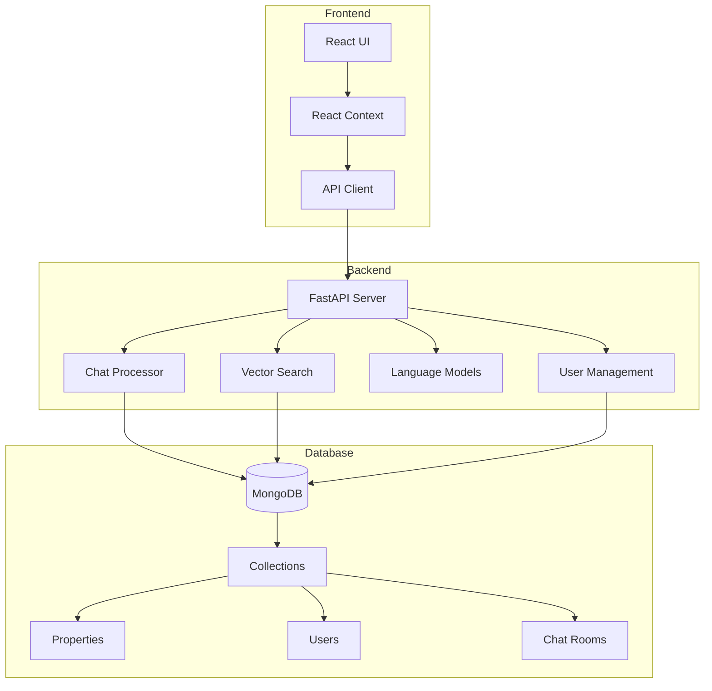
```mermaid
graph TB
    subgraph Frontend
        UI[React UI]
        State[React Context]
        API[API Client]
    end

    subgraph Backend
        FastAPI[FastAPI Server]
        Chat[Chat Processor]
        Vector[Vector Search]
        Lang[Language Models]
        User[User Management]
    end

    subgraph Database
        MongoDB[(MongoDB)]
        Collections[Collections]
        Properties[Properties]
        Users[Users]
        ChatRooms[Chat Rooms]
    end

    UI --> State
    State --> API
    API --> FastAPI
    FastAPI --> Chat
    FastAPI --> Vector
    FastAPI --> Lang
    FastAPI --> User
    Chat --> MongoDB
    Vector --> MongoDB
    User --> MongoDB
    MongoDB --> Collections
    Collections --> Properties
    Collections --> Users
    Collections --> ChatRooms
```

## 2. Flow การทำงานหลัก (Main Workflow)
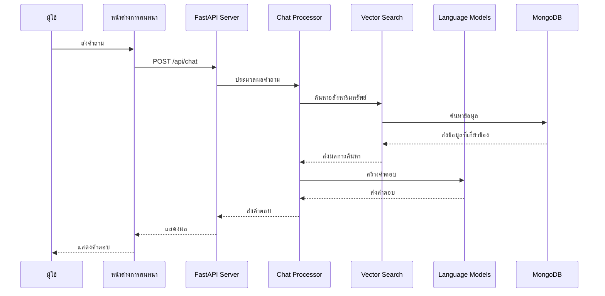
```mermaid
sequenceDiagram
    participant User as ผู้ใช้
    participant UI as หน้าต่างการสนทนา
    participant API as FastAPI Server
    participant Chat as Chat Processor
    participant Vector as Vector Search
    participant Lang as Language Models
    participant DB as MongoDB

    User->>UI: ส่งคำถาม
    UI->>API: POST /api/chat
    API->>Chat: ประมวลผลคำถาม
    Chat->>Vector: ค้นหาอสังหาริมทรัพย์
    Vector->>DB: ค้นหาข้อมูล
    DB-->>Vector: ส่งข้อมูลที่เกี่ยวข้อง
    Vector-->>Chat: ส่งผลการค้นหา
    Chat->>Lang: สร้างคำตอบ
    Lang-->>Chat: ส่งคำตอบ
    Chat-->>API: ส่งคำตอบ
    API-->>UI: แสดงผล
    UI-->>User: แสดงคำตอบ
```

## 3. Flow การลงทะเบียน (Registration Flow)
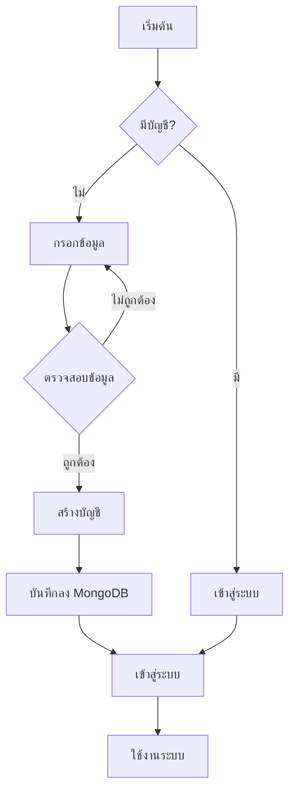
```mermaid
graph TD
    A[เริ่มต้น] --> B{มีบัญชี?}
    B -->|ไม่| C[กรอกข้อมูล]
    B -->|มี| D[เข้าสู่ระบบ]
    C --> E{ตรวจสอบข้อมูล}
    E -->|ไม่ถูกต้อง| C
    E -->|ถูกต้อง| F[สร้างบัญชี]
    F --> G[บันทึกลง MongoDB]
    G --> H[เข้าสู่ระบบ]
    D --> H
    H --> I[ใช้งานระบบ]
```

## 4. Flow การค้นหาอสังหาริมทรัพย์ (Property Search Flow)
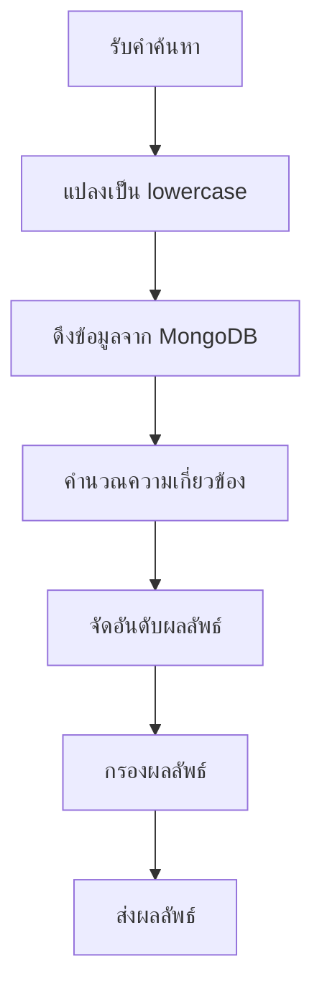
```mermaid
graph TD
    A[รับคำค้นหา] --> B[แปลงเป็น lowercase]
    B --> C[ดึงข้อมูลจาก MongoDB]
    C --> D[คำนวณความเกี่ยวข้อง]
    D --> E[จัดอันดับผลลัพธ์]
    E --> F[กรองผลลัพธ์]
    F --> G[ส่งผลลัพธ์]
```

## 5. Flow การสร้างคำตอบ (Response Generation Flow)
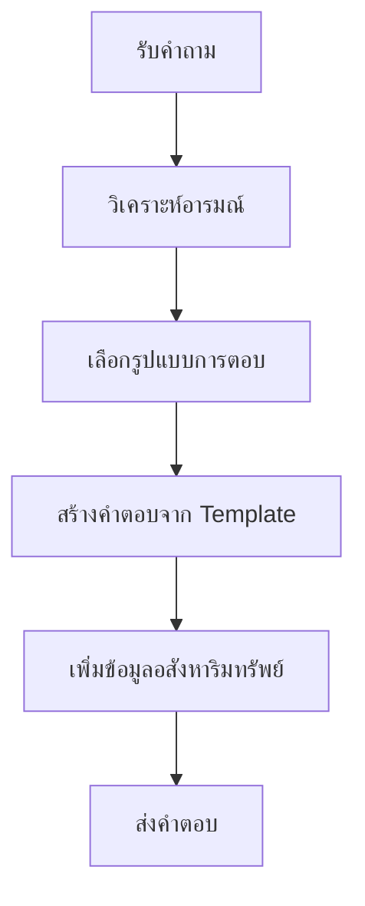
```mermaid
graph TD
    A[รับคำถาม] --> B[วิเคราะห์อารมณ์]
    B --> C[เลือกรูปแบบการตอบ]
    C --> D[สร้างคำตอบจาก Template]
    D --> E[เพิ่มข้อมูลอสังหาริมทรัพย์]
    E --> F[ส่งคำตอบ]
```

## 6. โครงสร้างฐานข้อมูล (Database Schema)
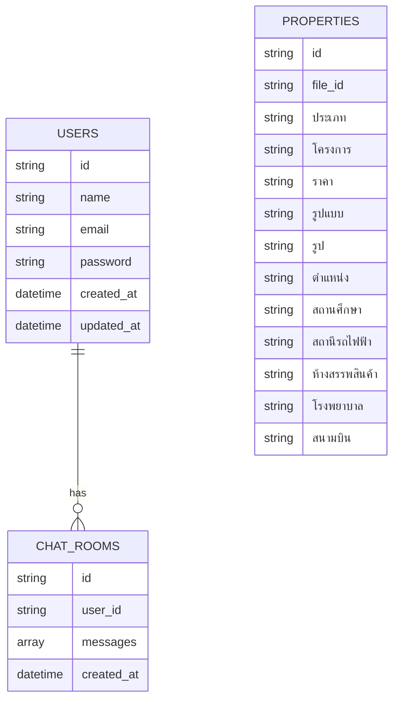
```mermaid
erDiagram
    USERS ||--o{ CHAT_ROOMS : has
    USERS {
        string id
        string name
        string email
        string password
        datetime created_at
        datetime updated_at
    }
    CHAT_ROOMS {
        string id
        string user_id
        array messages
        datetime created_at
    }
    PROPERTIES {
        string id
        string file_id
        string ประเภท
        string โครงการ
        string ราคา
        string รูปแบบ
        string รูป
        string ตำแหน่ง
        string สถานศึกษา
        string สถานีรถไฟฟ้า
        string ห้างสรรพสินค้า
        string โรงพยาบาล
        string สนามบิน
    }
```

## 7. Flow การอัปโหลดข้อมูล (Data Upload Flow)
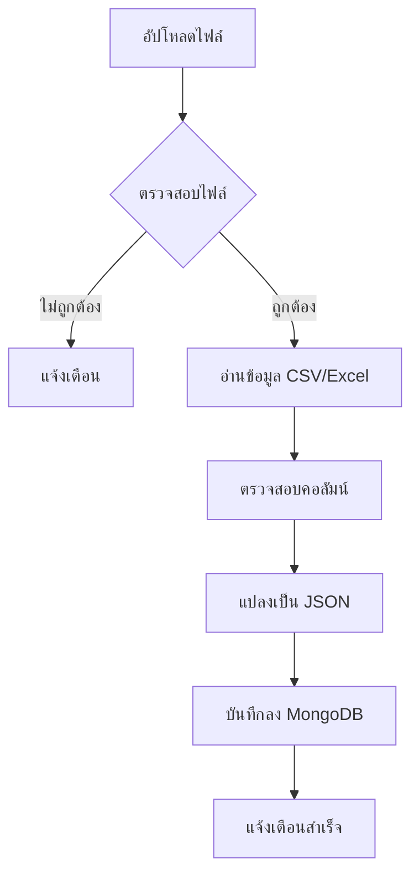
```mermaid
graph TD
    A[อัปโหลดไฟล์] --> B{ตรวจสอบไฟล์}
    B -->|ไม่ถูกต้อง| C[แจ้งเตือน]
    B -->|ถูกต้อง| D[อ่านข้อมูล CSV/Excel]
    D --> E[ตรวจสอบคอลัมน์]
    E --> F[แปลงเป็น JSON]
    F --> G[บันทึกลง MongoDB]
    G --> H[แจ้งเตือนสำเร็จ]
```

## 8. Flow การจัดการเซสชัน (Session Management Flow)
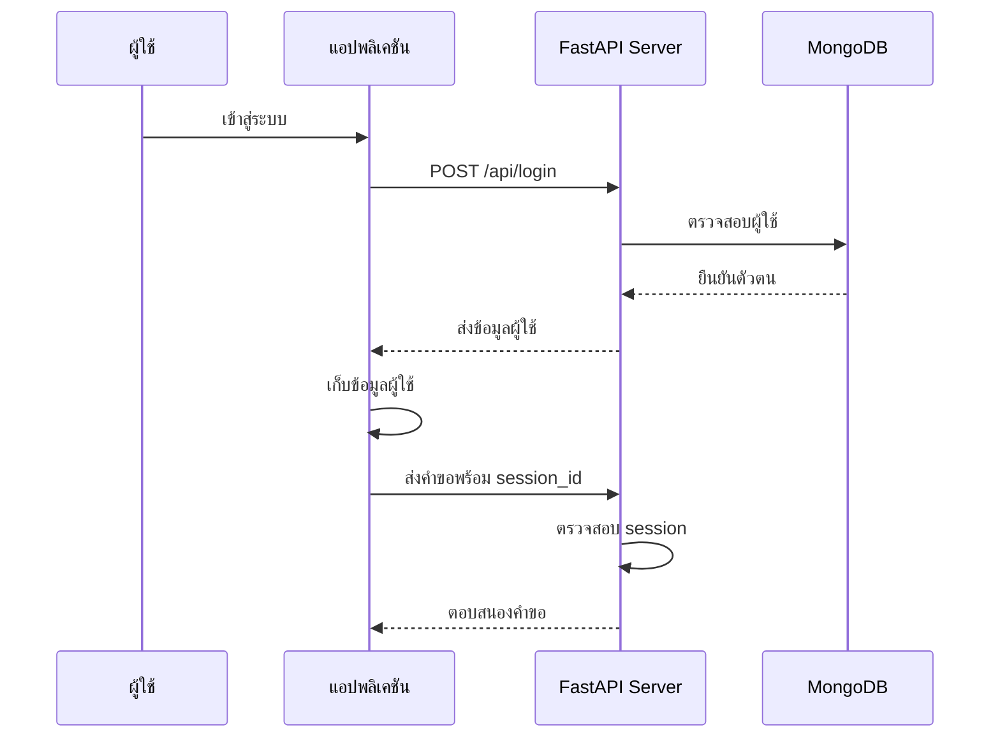
```mermaid
sequenceDiagram
    participant User as ผู้ใช้
    participant App as แอปพลิเคชัน
    participant API as FastAPI Server
    participant DB as MongoDB

    User->>App: เข้าสู่ระบบ
    App->>API: POST /api/login
    API->>DB: ตรวจสอบผู้ใช้
    DB-->>API: ยืนยันตัวตน
    API-->>App: ส่งข้อมูลผู้ใช้
    App->>App: เก็บข้อมูลผู้ใช้
    App->>API: ส่งคำขอพร้อม session_id
    API->>API: ตรวจสอบ session
    API-->>App: ตอบสนองคำขอ
```

## 9. Flow การแปลภาษา (Language Translation Flow)
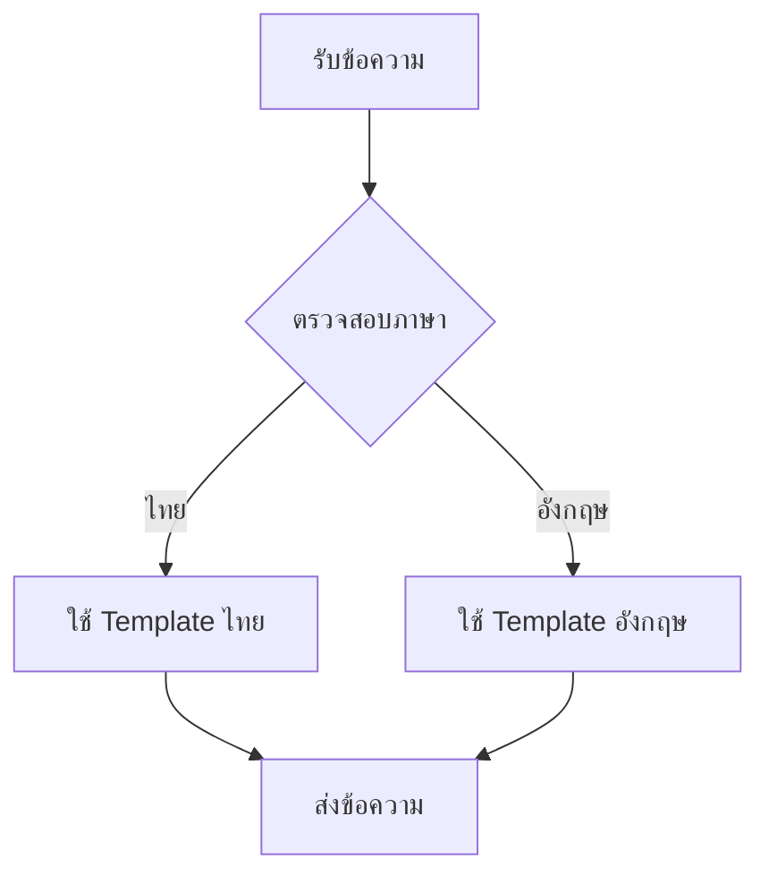
```mermaid
graph TD
    A[รับข้อความ] --> B{ตรวจสอบภาษา}
    B -->|ไทย| C[ใช้ Template ไทย]
    B -->|อังกฤษ| D[ใช้ Template อังกฤษ]
    C --> E[ส่งข้อความ]
    D --> E
```

## 10. Flow การจัดการข้อผิดพลาด (Error Handling Flow)
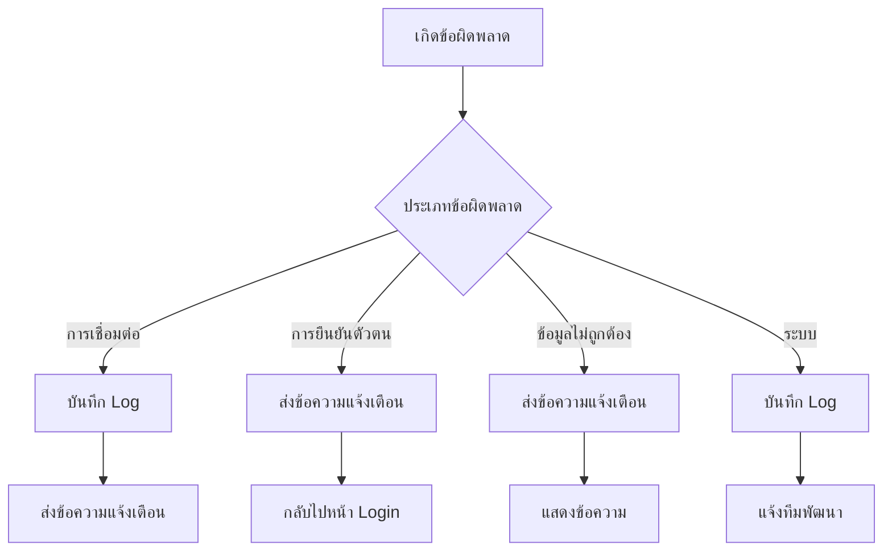
```mermaid
graph TD
    A[เกิดข้อผิดพลาด] --> B{ประเภทข้อผิดพลาด}
    B -->|การเชื่อมต่อ| C[บันทึก Log]
    B -->|การยืนยันตัวตน| D[ส่งข้อความแจ้งเตือน]
    B -->|ข้อมูลไม่ถูกต้อง| E[ส่งข้อความแจ้งเตือน]
    B -->|ระบบ| F[บันทึก Log]
    C --> G[ส่งข้อความแจ้งเตือน]
    D --> H[กลับไปหน้า Login]
    E --> I[แสดงข้อความ]
    F --> J[แจ้งทีมพัฒนา]
```

## 11. Flow การวิเคราะห์อารมณ์ (Emotion Analysis Flow)
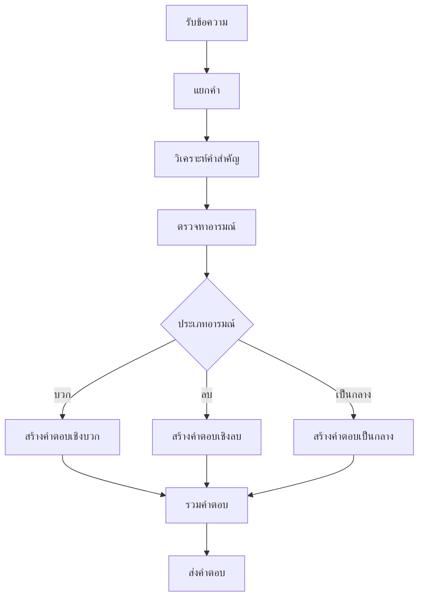
```mermaid
graph TD
    A[รับข้อความ] --> B[แยกคำ]
    B --> C[วิเคราะห์คำสำคัญ]
    C --> D[ตรวจหาอารมณ์]
    D --> E{ประเภทอารมณ์}
    E -->|บวก| F[สร้างคำตอบเชิงบวก]
    E -->|ลบ| G[สร้างคำตอบเชิงลบ]
    E -->|เป็นกลาง| H[สร้างคำตอบเป็นกลาง]
    F --> I[รวมคำตอบ]
    G --> I
    H --> I
    I --> J[ส่งคำตอบ]
```

## 12. Flow การจัดการข้อมูลอสังหาริมทรัพย์ (Property Data Management)
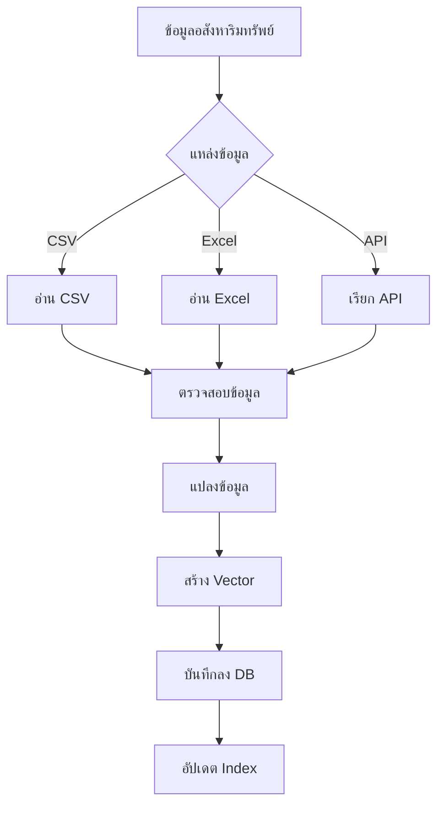
```mermaid
graph TD
    A[ข้อมูลอสังหาริมทรัพย์] --> B{แหล่งข้อมูล}
    B -->|CSV| C[อ่าน CSV]
    B -->|Excel| D[อ่าน Excel]
    B -->|API| E[เรียก API]
    C --> F[ตรวจสอบข้อมูล]
    D --> F
    E --> F
    F --> G[แปลงข้อมูล]
    G --> H[สร้าง Vector]
    H --> I[บันทึกลง DB]
    I --> J[อัปเดต Index]
```

## 13. Flow การทำงานของ Vector Search
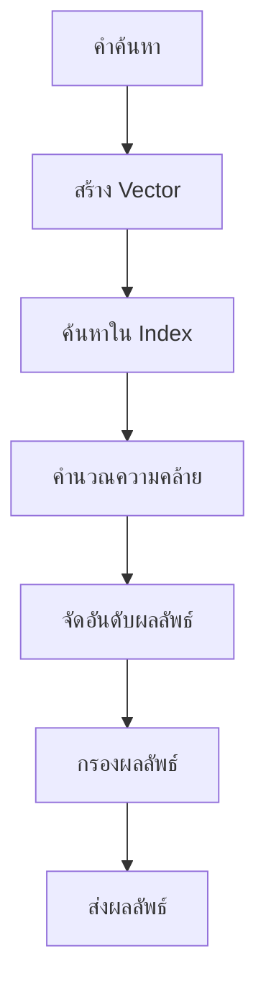
```mermaid
graph TD
    A[คำค้นหา] --> B[สร้าง Vector]
    B --> C[ค้นหาใน Index]
    C --> D[คำนวณความคล้าย]
    D --> E[จัดอันดับผลลัพธ์]
    E --> F[กรองผลลัพธ์]
    F --> G[ส่งผลลัพธ์]
```

## 14. Flow การจัดการ Cache
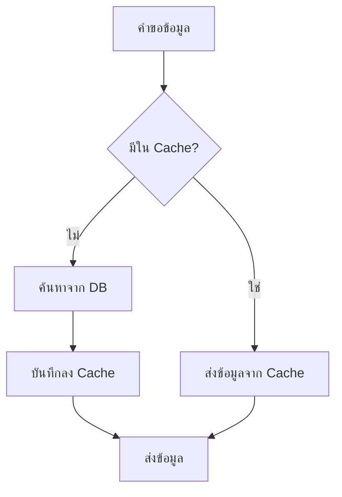
```mermaid
graph TD
    A[คำขอข้อมูล] --> B{มีใน Cache?}
    B -->|ใช่| C[ส่งข้อมูลจาก Cache]
    B -->|ไม่| D[ค้นหาจาก DB]
    D --> E[บันทึกลง Cache]
    E --> F[ส่งข้อมูล]
    C --> F
```

## 15. Flow การทำความสะอาดข้อมูล (Data Cleaning)
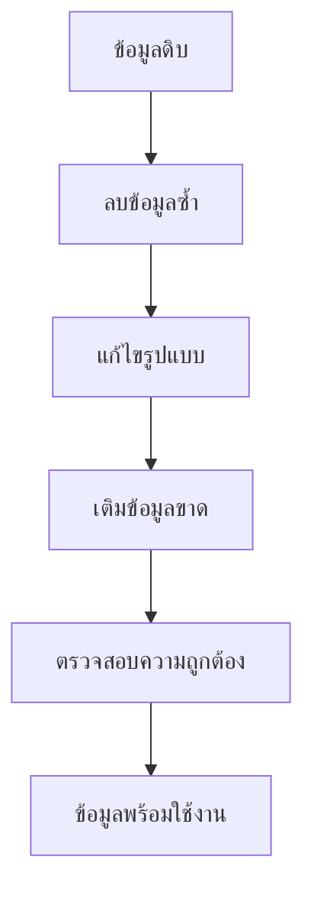
```mermaid
graph TD
    A[ข้อมูลดิบ] --> B[ลบข้อมูลซ้ำ]
    B --> C[แก้ไขรูปแบบ]
    C --> D[เติมข้อมูลขาด]
    D --> E[ตรวจสอบความถูกต้อง]
    E --> F[ข้อมูลพร้อมใช้งาน]
```

## 16. Flow การอัปเดตระบบ (System Update)
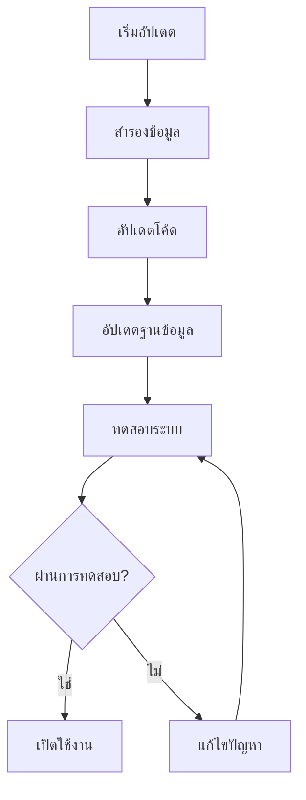
```mermaid
graph TD
    A[เริ่มอัปเดต] --> B[สำรองข้อมูล]
    B --> C[อัปเดตโค้ด]
    C --> D[อัปเดตฐานข้อมูล]
    D --> E[ทดสอบระบบ]
    E --> F{ผ่านการทดสอบ?}
    F -->|ใช่| G[เปิดใช้งาน]
    F -->|ไม่| H[แก้ไขปัญหา]
    H --> E
```

## 17. Flow การจัดการสิทธิ์ (Permission Management)
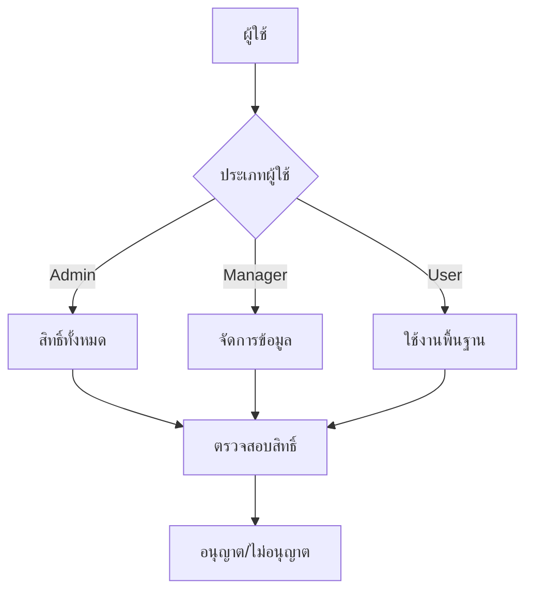
```mermaid
graph TD
    A[ผู้ใช้] --> B{ประเภทผู้ใช้}
    B -->|Admin| C[สิทธิ์ทั้งหมด]
    B -->|Manager| D[จัดการข้อมูล]
    B -->|User| E[ใช้งานพื้นฐาน]
    C --> F[ตรวจสอบสิทธิ์]
    D --> F
    E --> F
    F --> G[อนุญาต/ไม่อนุญาต]
```

## 18. Flow การสำรองข้อมูล (Backup Flow)
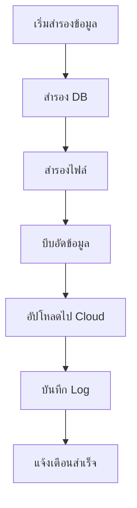
```mermaid
graph TD
    A[เริ่มสำรองข้อมูล] --> B[สำรอง DB]
    B --> C[สำรองไฟล์]
    C --> D[บีบอัดข้อมูล]
    D --> E[อัปโหลดไป Cloud]
    E --> F[บันทึก Log]
    F --> G[แจ้งเตือนสำเร็จ]
```

## 19. Flow การ Monitor ระบบ (System Monitoring)
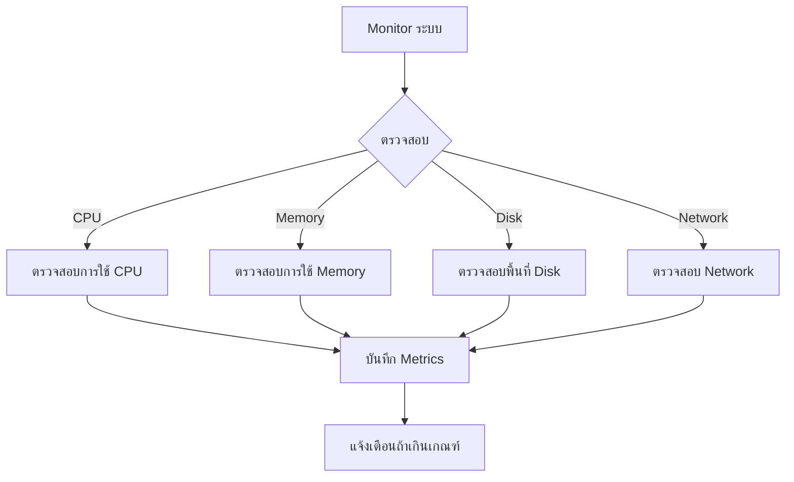
```mermaid
graph TD
    A[Monitor ระบบ] --> B{ตรวจสอบ}
    B -->|CPU| C[ตรวจสอบการใช้ CPU]
    B -->|Memory| D[ตรวจสอบการใช้ Memory]
    B -->|Disk| E[ตรวจสอบพื้นที่ Disk]
    B -->|Network| F[ตรวจสอบ Network]
    C --> G[บันทึก Metrics]
    D --> G
    E --> G
    F --> G
    G --> H[แจ้งเตือนถ้าเกินเกณฑ์]
```

## 20. Flow การ Deploy ระบบ (Deployment Flow)
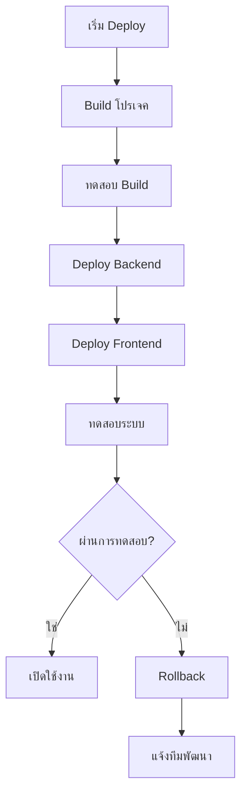
```mermaid
graph TD
    A[เริ่ม Deploy] --> B[Build โปรเจค]
    B --> C[ทดสอบ Build]
    C --> D[Deploy Backend]
    D --> E[Deploy Frontend]
    E --> F[ทดสอบระบบ]
    F --> G{ผ่านการทดสอบ?}
    G -->|ใช่| H[เปิดใช้งาน]
    G -->|ไม่| I[Rollback]
    I --> J[แจ้งทีมพัฒนา]
``` 