# ไดอะแกรมการทำงาน

## ภาพรวม

ไดอะแกรมการทำงานแสดงถึงลำดับขั้นตอนและความสัมพันธ์ระหว่างส่วนต่างๆ ของระบบ AI Property Consultant เพื่อให้เข้าใจการทำงานของระบบได้อย่างชัดเจน

## ไดอะแกรมการทำงานหลัก

### 1. การลงทะเบียนและเข้าสู่ระบบ
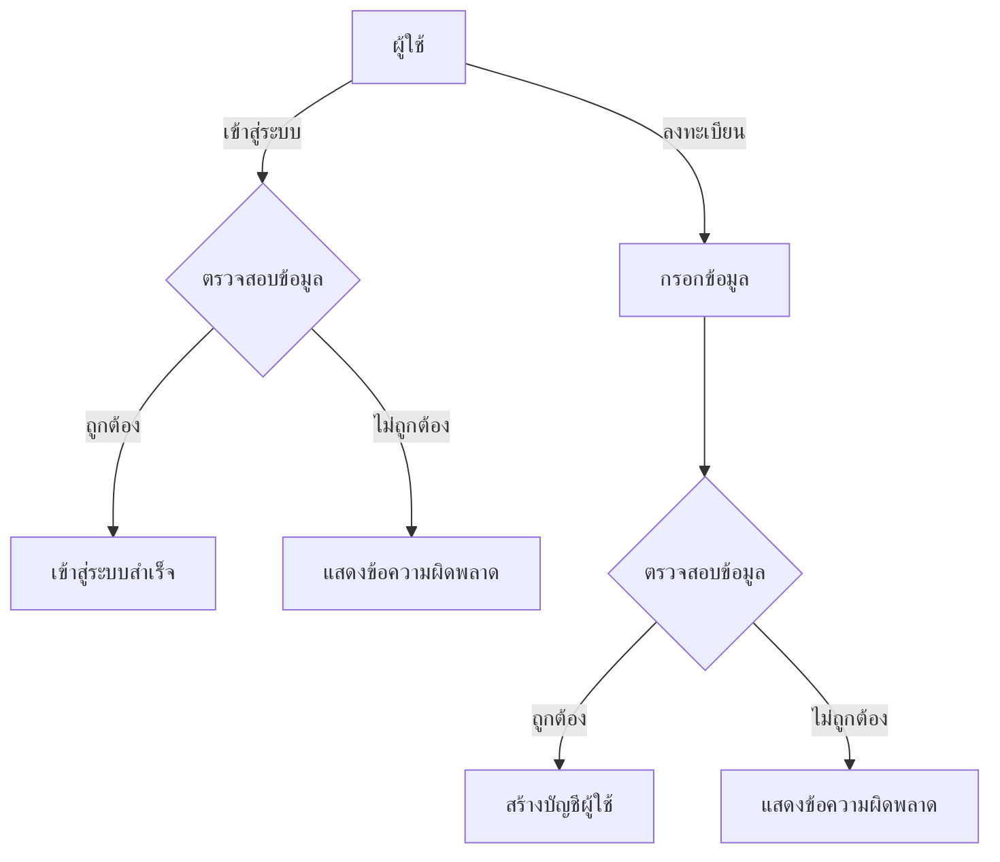

### 2. การค้นหาอสังหาริมทรัพย์
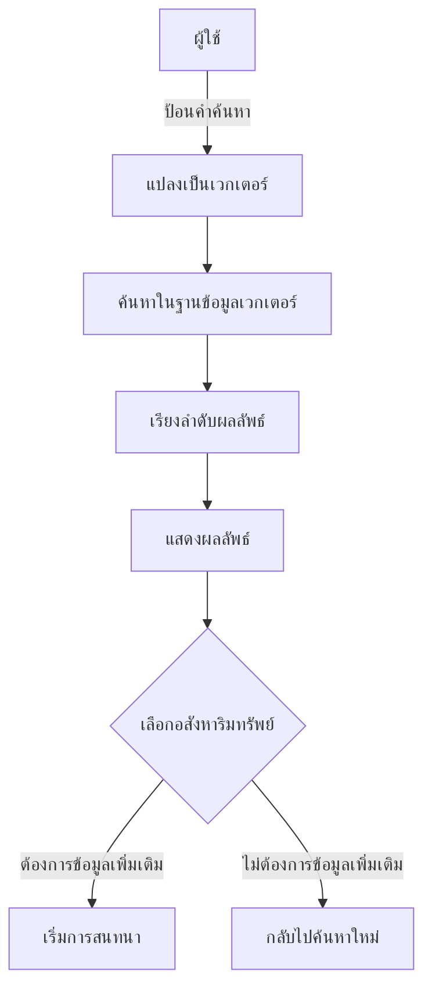

### 3. การสนทนากับ AI
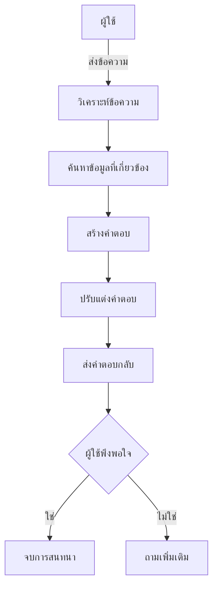

### 4. การจัดการข้อมูล
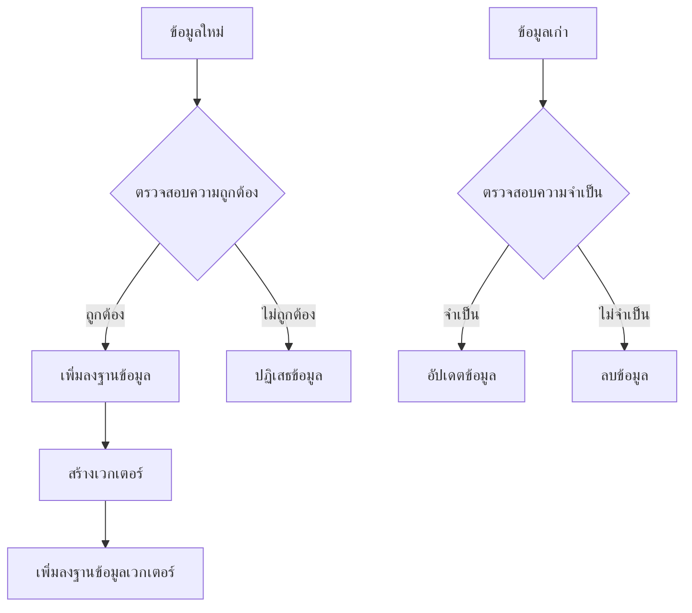

## ไดอะแกรมการทำงานย่อย

### 1. การวิเคราะห์ผู้ใช้
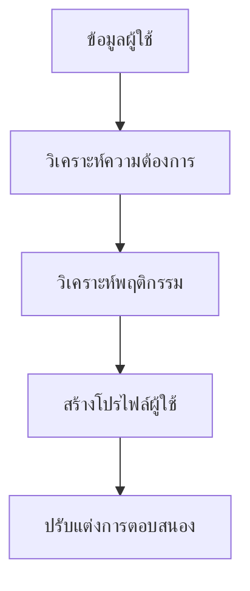

### 2. การจัดการเซสชัน
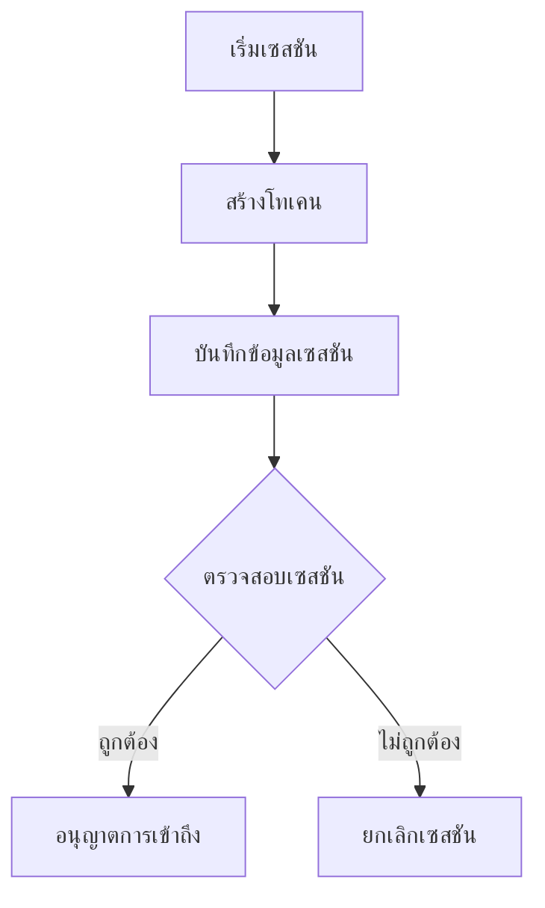

### 3. การสำรองข้อมูล
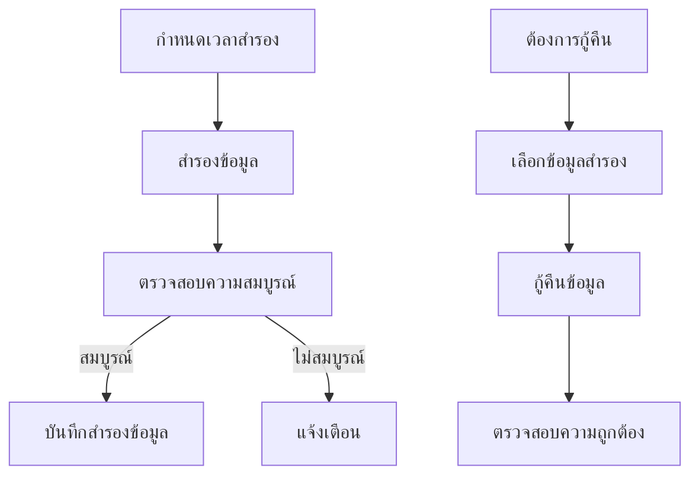

## การประมวลผลแบบเรียลไทม์

### 1. การประมวลผลข้อความ
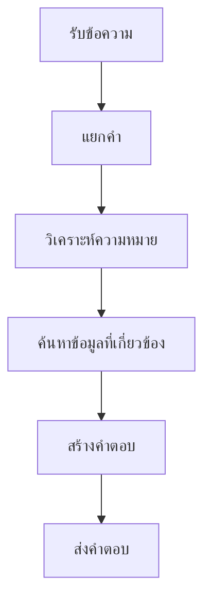

### 2. การประมวลผลรูปภาพ
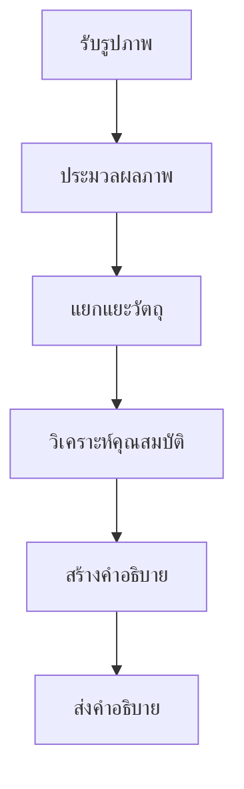

## การจัดการข้อผิดพลาด

### 1. การจัดการข้อผิดพลาดทั่วไป
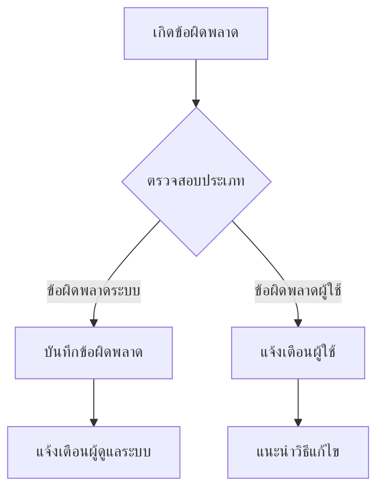

### 2. การกู้คืนระบบ
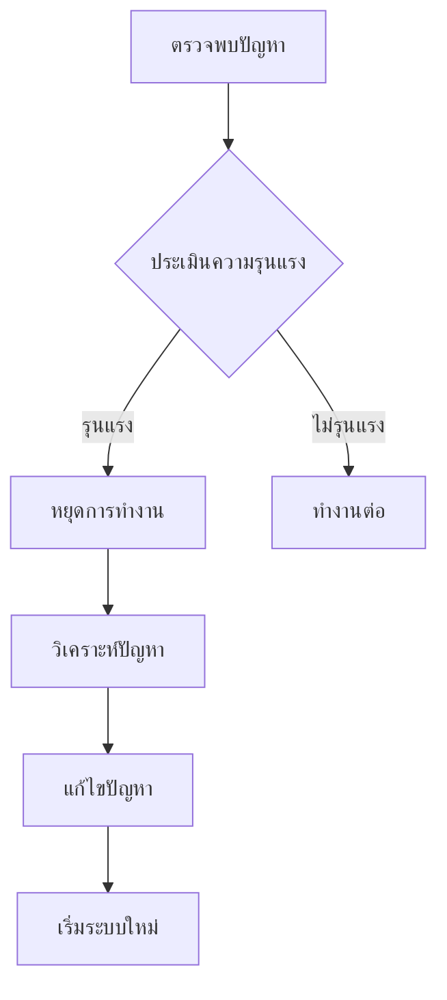